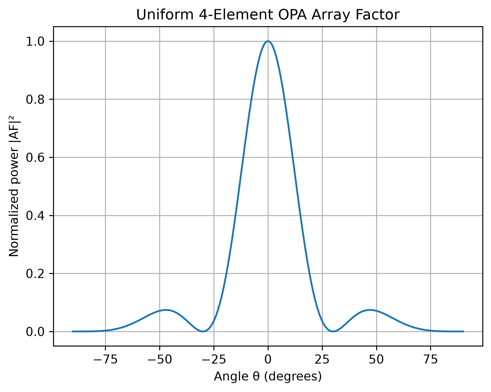

# openEBL OPA Tapeout 2026

Passive silicon-photonic optical phased array design for the openEBL 2026-10 fabrication run.

## Objective

Design, simulate, verify, and submit a fabrication-ready passive 1×4 optical phased array on the SiEPIC EBeam platform.

## Process

- 220 nm SOI
- Single full silicon etch
- Oxide cladding
- SiEPIC-EBeam-PDK
- KLayout + SiEPIC verification
- No heaters or metal phase shifters

## Architecture

```text
                         ┌── Path delay L0 ───► Antenna 0
                         │
Input ───► 1×4 splitter ─┼── Path delay L1 ───► Antenna 1
                         │
                         ├── Path delay L2 ───► Antenna 2
                         │
                         └── Path delay L3 ───► Antenna 3
```

The waveguide path lengths control the relative emitter phases:

$$
\phi_n = \beta L_n
$$

where

$$
\beta = \frac{2\pi n_{\mathrm{eff}}}{\lambda}.
$$

The array factor is

$$
AF(\theta)
=
\sum_n A_n
e^{j(\phi_n-k_0x_n\sin\theta)}.
$$

## Day 1 Result

Implemented and validated the first analytical 4-element array-factor model.

Initial test case:

- Number of emitters: \(N = 4\)
- Equal amplitudes
- Equal phases
- Pitch: \(d = \lambda/2\)
- Main beam: \(\theta = 0^\circ\)

## Day 1 Array-Factor Result



## Repository Structure

- `src/opa_design/` — analytical and design code
- `docs/` — requirements and documentation
- `figures/` — generated plots
- `simulations/` — electromagnetic simulation results
- `layout/` — generated photonic layouts
- `tests/` — verification tests
- `releases/` — fabrication release files
